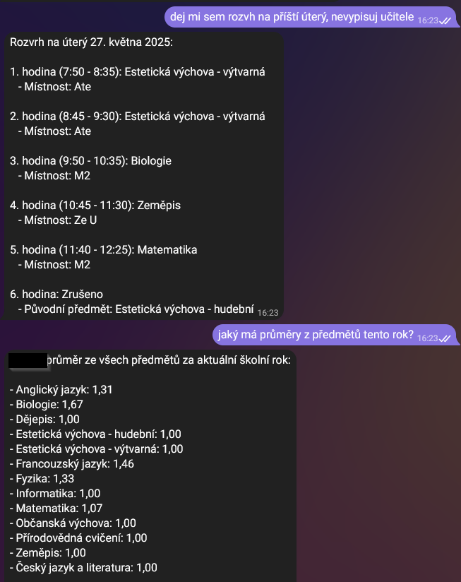

# Bakaláři MCP Server

MCP (Model Context Protocol) server pro Bakaláři v3 API. Umožňuje přístup k Bakaláři školnímu systému přes standardizované MCP rozhraní. 

<div align="center">
  
[](https://www.buymeacoffee.com/mirecekdg)

</div>

## Upozornění

!! K používání tohoto projektu je potřeba trošku umět s dockerem/pythonem a vědět, jak funguje připojení MCP k danému LLM klientu !!

## Funkce

- **rozvrh** - Získání rozvrhu pro konkrétní datum nebo aktuální rozvrh
- **staly_rozvrh** - Získání stálého rozvrhu (základní rozvrh bez změn)
- **absence** - Získání informací o basencích
- **znamky** - Získání informací o známkách


## Instalace a spuštění

### Dostupné transport metody

Server podporuje tři transport metody:

1. **CLI (stdio)** - Přímá MCP komunikace přes stdin/stdout
2. **Proxy (HTTP)** - HTTP server pomocí mcp-proxy na portu 8805
3. **HTTP Streaming** - Nativní HTTP streaming transport na portu 8806

### Spuštění jako HTTP Streaming server

Pro spuštění s nativním HTTP streaming transportem na portu 8806:

```bash
# Build HTTP streaming image
./build-http.sh
# nebo manuálně
docker build -f Dockerfile.http -t mirecekd/bakalari-mcp:http .

# Spuštění
docker run -p 8806:8806 mirecekd/bakalari-mcp:http \
  --user YOUR_USERNAME \
  --password YOUR_PASSWORD \
  --url https://your-school.bakalari.cz
```

Server bude dostupný jako HTTP streaming MCP na `http://localhost:8806`.

### Spuštění jako HTTP server pomocí MCP proxy

Pro spuštění jako HTTP server na portu 8805:

```bash
# Build MCP proxy image
./build-proxy.sh
# nebo manuálně
docker build -f Dockerfile.proxy -t mirecekd/bakalari-mcp:proxy .

# Spuštění s environment variables
docker run -e BAKALARI_USER=your_user -e BAKALARI_PASSWORD=your_pass -e BAKALARI_URL=your_url -p 8805:8805 mirecekd/bakalari-mcp:proxy
```

Server bude dostupný jako SSE MCP na `http://localhost:8805`.

### Spuštění pomocí Docker (stdio mode)

#### Rychlé spuštění

```bash
# Build CLI Docker image
./build-cli.sh
# nebo manuálně
docker build -f Dockerfile.cli -t mirecekd/bakalari-mcp:cli .

# Spuštění přes Docker
docker run --rm -i mirecekd/bakalari-mcp:cli \
  --user USERNAME \
  --password PASSWORD \
  --url https://your-school.bakalari.cz
```

#### Spuštění s docker-compose

```bash
# Zkopíruj a upravuješ konfiguraci
cp .env.example .env
# Edituj .env s tvými údaji

# Spuštění
docker-compose up bakalari-mcp-server

# Nebo pro development (s live reloading)
docker-compose --profile dev up bakalari-mcp-dev
```

#### Přímé spuštění jedním příkazem

```bash
# Pro MCP konfiguraci - nahraď uvx příkaz tímto:
docker run --rm -i bakalari-mcp-server \
  --user YOUR_USER \
  --password YOUR_PASSWORD \
  --url https://skola.bakalari.cz
```

### Spuštění pomocí uvx (alternativa)

Pokud máš již vybuilděný balíček:

```bash
# Z místního wheel souboru
uvx --from ./dist/bakalari_mcp_server-1.0.0-py3-none-any.whl bakalari-mcp-server --user USERNAME --password PASSWORD --url https://your-school.bakalari.cz

# Nebo z aktuálního adresáře během vývoje
uvx --from . bakalari-mcp-server --user USERNAME --password PASSWORD --url https://your-school.bakalari.cz
```

## Jak to funguje

<div align="center">
  
</div>


### Build balíčku

Pro vytvoření distribučního balíčku:

```bash
# Instalace build nástrojů
pip install build

# Vytvoření balíčku
python3 -m build

# Výsledné soubory najdeš v dist/
```

### Spuštění ze zdrojového kódu

```bash
# Instalace závislostí
pip install fastmcp aiohttp

# Spuštění ze zdrojového kódu
python3 src/bakalari_mcp_server/server.py --user USERNAME --password PASSWORD --url https://your-school.bakalari.cz
```

## Parametry

- `--user` (povinný): Uživatelské jméno pro Bakaláři
- `--password` (povinný): Heslo pro Bakaláři  
- `--url` (povíně volitelný): URL Bakaláři serveru (výchozí: https://skola.bakalari.cz)

## Dostupné nástroje

### rozvrh(datum)

Získá rozvrh pro zadané datum s dekódovanými informacemi.

**Parametry:**
- `datum` (volitelný): Datum ve formátu YYYY-MM-DD. Pokud není zadáno, použije se dnešní datum.

**Příklad odpovědi:**
```json
{
  "datum": "2025-05-15",
  "den_tydne": 5,
  "hodiny": [
    {
      "hodina": "1",
      "cas": "8:00 - 8:45",
      "predmet": "Matematika",
      "zkratka_predmetu": "M",
      "ucitel": "Nov",
      "mistnost": "123",
      "tema": "Kvadratické rovnice",
      "zmena": {
        "typ": "Modified",
        "popis": "Změna učitele"
      }
    }
  ],
  "pocet_hodin": 6
}
```

### staly_rozvrh()

Získá stálý rozvrh (základní rozvrh bez změn).

**Příklad odpovědi:**
```json
{
  "typ": "staly_rozvrh",
  "dny": [
    {
      "den_tydne": 1,
      "den_cislo": 1,
      "hodiny": [
        {
          "hodina": "1",
          "cas": "8:00 - 8:45",
          "predmet": "Matematika",
          "zkratka_predmetu": "M",
          "ucitel": "Nov", 
          "mistnost": "123",
          "skupina": null
        }
      ]
    }
  ]
}
```

## Konfigurace v MCP klientovi (Claude Desktop / n8n)

### Pro stdio mode (původní způsob)

Pro použití s Docker místo uvx, aktualizuj MCP konfiguraci:

```json
{
  "mcpServers": {
    "bakalari-mcp-server": {
      "autoApprove": [
        "rozvrh",
        "staly_rozvrh"
      ],
      "disabled": false,
      "timeout": 60,
      "command": "docker",
      "args": [
        "run",
        "--rm",
        "-i",
        "bakalari-mcp-server",
        "--user",
        "YOUR_USER",
        "--password",
        "YOUR_PASSWORD", 
        "--url",
        "https://skola.bakalari.cz"
      ],
      "transportType": "stdio"
    }
  }
}
```

### Pro HTTP mode (nový způsob s MCP proxy)

Pro použití jako HTTP server přes MCP proxy:

```json
{
  "mcpServers": {
    "bakalari-mcp-server": {
      "autoApprove": [
        "rozvrh",
        "staly_rozvrh"
      ],
      "disabled": false,
      "timeout": 60,
      "url": "http://localhost:8805",
      "transportType": "http"
    }
  }
}
```

### Pro HTTP Streaming mode (nejnovější)

Pro použití s nativním HTTP streaming transportem:

```json
{
  "mcpServers": {
    "bakalari-mcp-server": {
      "autoApprove": [
        "rozvrh",
        "staly_rozvrh"
      ],
      "disabled": false,
      "timeout": 60,
      "url": "http://localhost:8806",
      "transportType": "http"
    }
  }
}
```

## GitHub Container Registry (GHCR)

Pre-built Docker images jsou dostupné na GitHub Container Registry:

### Dostupné images:

- **CLI (stdio)**: `ghcr.io/mirecekd/bakalari-mcp:latest-cli`
- **Proxy (HTTP)**: `ghcr.io/mirecekd/bakalari-mcp:latest-proxy`  
- **HTTP Streaming**: `ghcr.io/mirecekd/bakalari-mcp:latest-http`

### Použití GHCR images:

```bash
# CLI version
docker run --rm -i ghcr.io/mirecekd/bakalari-mcp:latest-cli \
  --user USERNAME --password PASSWORD --url https://school.bakalari.cz

# Proxy version (port 8805)
docker run -p 8805:8805 \
  -e BAKALARI_USER=USERNAME \
  -e BAKALARI_PASSWORD=PASSWORD \
  -e BAKALARI_URL=https://school.bakalari.cz \
  ghcr.io/mirecekd/bakalari-mcp:latest-proxy

# HTTP Streaming version (port 8806)
docker run -p 8806:8806 ghcr.io/mirecekd/bakalari-mcp:latest-http \
  --user USERNAME --password PASSWORD --url https://school.bakalari.cz
```

### Multi-arch support:

Všechny images podporují:
- **linux/amd64** (Intel/AMD x64)
- **linux/arm64** (Apple Silicon, ARM64)

### Postupy pro MCP konfiguraci

1. **Vybuduj Docker image:**
   ```bash
   cd bakalari-mcp-server
   # Pro stdio mode:
   ./build-cli.sh
   # Pro HTTP mode:
   ./build-proxy.sh
   # Nebo oba najednou:
   ./build-all.sh
   ```

2. **Spusť kontejner** (pro HTTP mode):
   ```bash
   docker run -d -e BAKALARI_USER=your_user -e BAKALARI_PASSWORD=your_pass -e BAKALARI_URL=your_url -p 8805:8805 mirecekd/bakalari-mcp:proxy
   ```

3. **Aktualizuj MCP settings aplikace** v `claude_desktop_config.json`, `anythingllm_mcp_servers.json`, `cline_mcp_settings.json`
4. **Restartuj aplikaci** pro načtení nové konfigurace

## Autentizace

Server automaticky spravuje autentizaci:

1. Při prvním použití se přihlásí pomocí username/password
2. Získá access_token a refresh_token
3. Při expiraci access_token automaticky obnoví pomocí refresh_token
4. Pokud i refresh_token expiruje, znovu se přihlásí pomocí username/password

## Chybové stavy

Všechny nástroje vrací chybové zprávy v případě problémů:

```json
{
  "error": "Popis chyby"
}
```

Možné typy chyb:
- **Chyba autentizace**: Neplatné přihlašovací údaje nebo problémy s tokenem
- **Chyba API**: Problém s komunikací s Bakaláři API
- **Neplatný formát data**: Špatně zadané datum

## Příklad použití v MCP klientovi

```python
# Získání dnešního rozvrhu
result = await mcp_client.call_tool("rozvrh")

# Získání rozvrhu pro konkrétní datum
result = await mcp_client.call_tool("rozvrh", {"datum": "2024-03-15"})

# Získání stálého rozvrhu
result = await mcp_client.call_tool("staly_rozvrh")
```

## Pokročilé funkce

### Dekódování rozvrhu

Server inteligentně dekóduje rozvrh pomocí:

- **Lookup tabulek**: Překlad ID na čitelné názvy předmětů, učitelů, místností
- **Inference předmětů**: Automatické rozpoznání předmětu z tématu hodiny
- **Zpracování změn**: Detekce zrušených hodin, suplování a dalších změn
- **Validace dat**: Kontrola formátu data a základní validace

### Podpora změn v rozvrhu

Server rozpoznává a správně zpracovává:

- **Zrušené hodiny**: Označené jako ❌ se zachováním původních informací
- **Suplování**: Nový učitel s odkazem na původního
- **Spojené hodiny**: Sloučení více hodin do jedné
- **Změny místností**: Aktualizované místo konání

## Technické detaily

- **Protokol**: MCP přes stdio nebo HTTP (s mcp-proxy)
- **Framework**: FastMCP
- **HTTP klient**: aiohttp (async)
- **Python verze**: 3.8+
- **Distribuce**: source code
- **Proxy**: mcp-proxy pro HTTP transport

## Vývojáři

Pro lokální vývoj:

```bash
# Klonování a setup
git clone <repository-url>
cd bakalari-mcp-server

# Instalace dev závislostí  
pip install -e .

# Spuštění pro testování
python3 src/bakalari_mcp_server/server.py --user TEST --password TEST --url https://test.bakalari.cz
